# 🎓 Student Attendance Management System


A desktop-based Student Attendance Management System developed using **Python**, **Tkinter**, and **SQLite**.

The application enables teachers, students, and principals to manage attendance efficiently through manual attendance, QR Code-based attendance, attendance analytics, and student performance monitoring.

---

## Features

- 👨‍🏫 Teacher Portal
- 👨‍🎓 Student Portal
- 👔 Principal Portal
- 📷 QR Code Attendance
- 📊 Attendance Analytics
- 📈 Pie Chart Reports
- 🔐 Secure Login System
- 🗄 SQLite Database
- 🔔 Notification System
- ⚠ Attendance Warning Alerts
- 🌐 Local Web Attendance Portal
- 🖥 Desktop GUI using Tkinter

---

## Technologies Used

- Python
- Tkinter
- SQLite
- Pillow
- qrcode
- tkcalendar
- hashlib
- HTTP Server
- Threading

---

# 📸 Application Screenshots

<h2 align="center">Login Screen</h2>

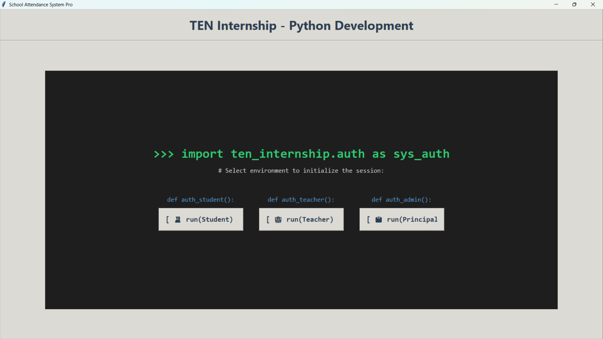

---

<h2 align="center">Teacher Dashboard</h2>

### Add Student

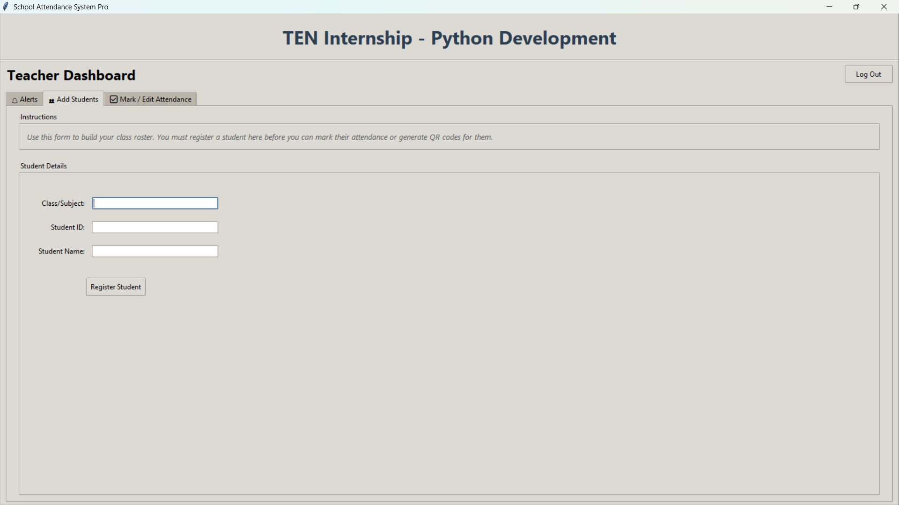

### Mark Attendance Manually

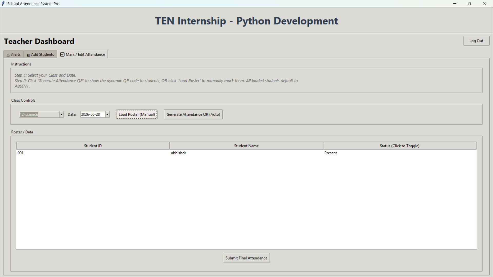

### QR Attendance

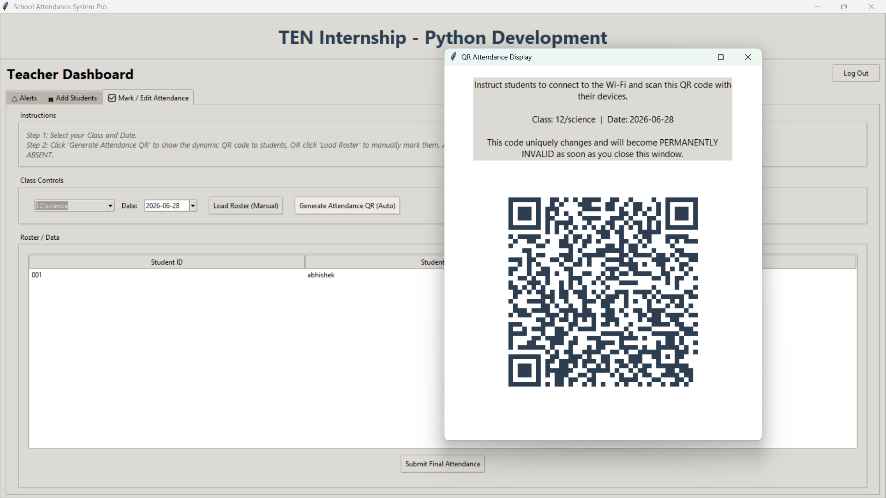

### Notifications

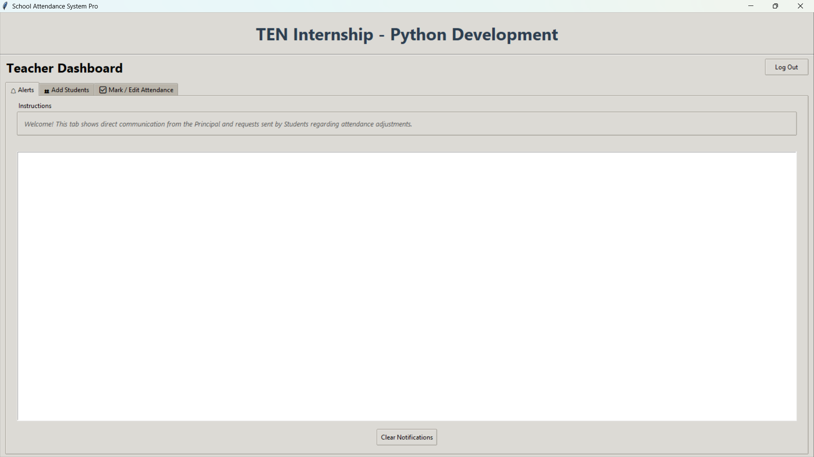

---

<h2 align="center">Student Dashboard</h2>

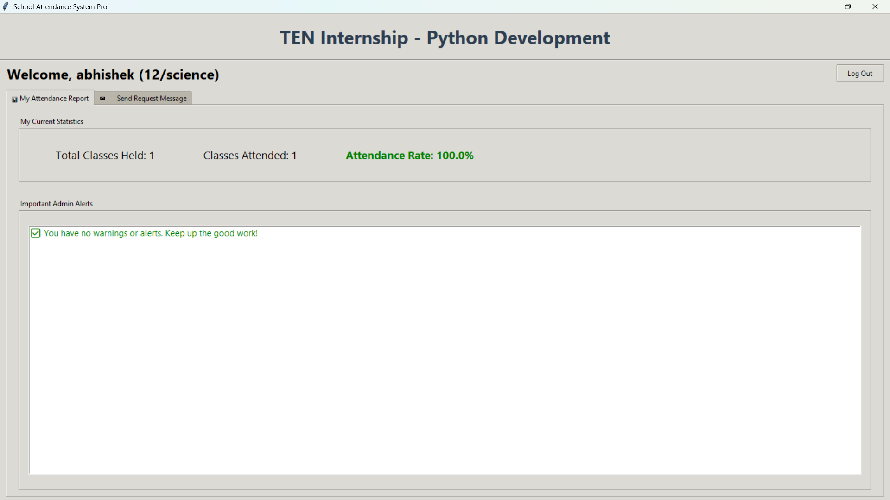

### Student Messages

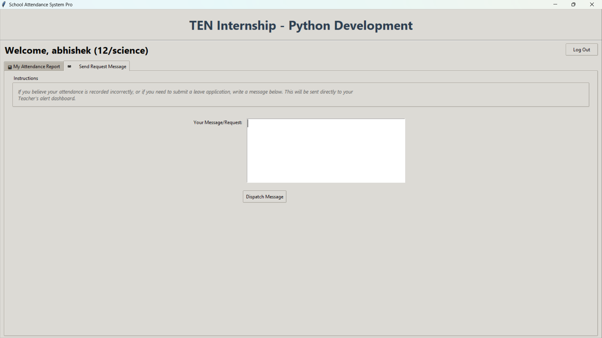

---

<h2 align="center">Principal Dashboard</h2>

### Actions

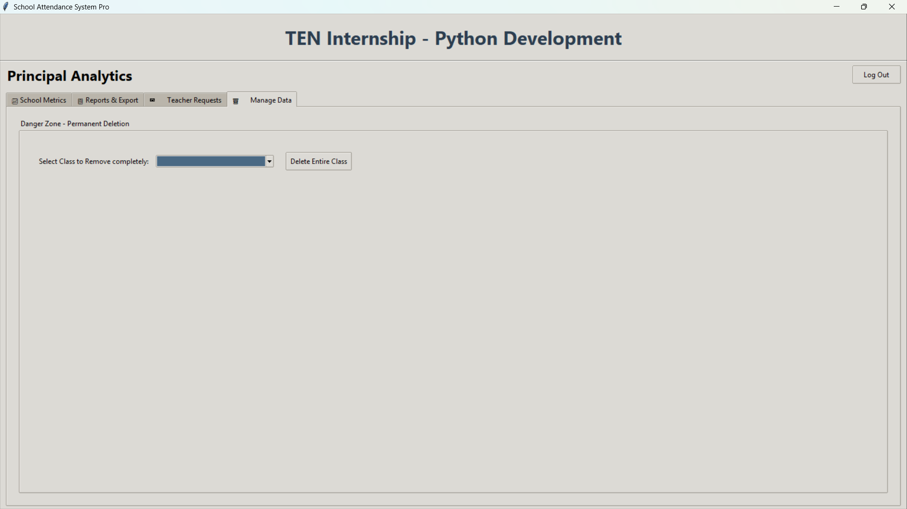

### Attendance Analytics

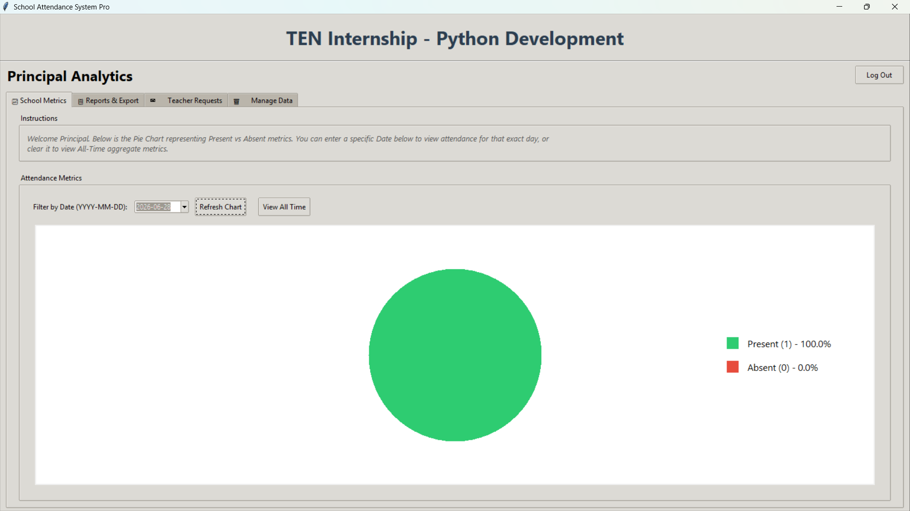

### Reports

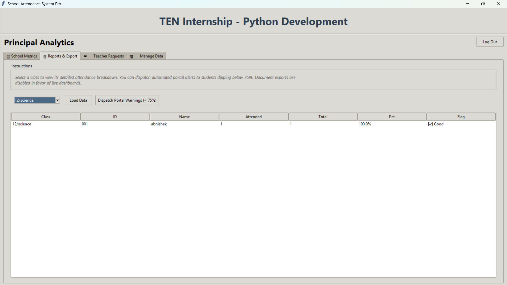

### Messages

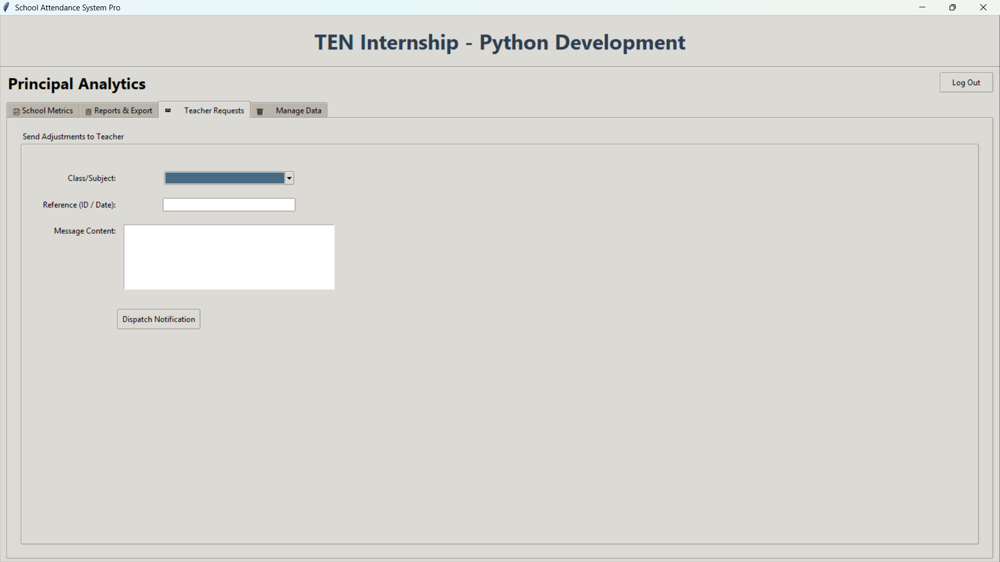

---

# 🚀 Installation

## Clone the Repository

```bash
git clone https://github.com/Somya6422/Student_Attendance_Management_System.git
```

## Navigate to the Project Folder

```bash
cd Student_Attendance_Management_System
```

## Install Dependencies

```bash
pip install -r requirements.txt
```

## Run the Application

```bash
python "Source Code.py"
```

---

# 📂 Project Structure

```
Student_Attendance_Management_System/
│
├── assets/
│   └── screenshots/
├── dist/
│   ├── Source Code.exe
│   └── attendance.db
├── Source Code.py
├── attendance.db
├── requirements.txt
├── README.md
└── LICENSE
```

---

# 👥 User Roles

### 👨‍🏫 Teacher

- Login securely
- Add students
- Mark attendance manually
- Generate QR Code attendance
- View notifications

### 👨‍🎓 Student

- Login
- View attendance percentage
- Receive attendance warnings
- View notifications

### 👔 Principal

- View attendance analytics
- Generate reports
- Send announcements
- Monitor overall attendance

---

# 🔮 Future Improvements

- Export reports to PDF
- Export attendance to Excel
- Email notifications
- Cloud database support
- Mobile application
- Face Recognition Attendance
- RFID/Fingerprint Attendance
- Multi-school support

---

# 🤝 Contributing

Contributions, suggestions, and bug reports are welcome.

If you find any issue, feel free to open an issue or submit a pull request.

---

# 📄 License

This project is licensed under the **GNU General Public License v3.0 (GPL-3.0)**.

See the LICENSE file for details.
